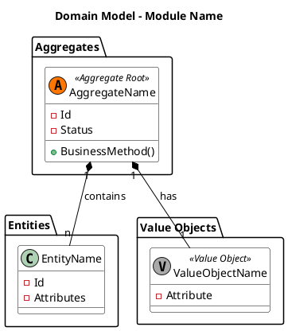

# Template: Domain Model Diagram

## Tactical Model

```plantuml
@startuml
skinparam class {
    BackgroundColor White
    ArrowColor Black
    BorderColor Black
}

title Domain Model - Module Name

package "Aggregates" {
    class AggregateName << (A,#FF7700) Aggregate Root >> {
        - Id
        - Status
        + BusinessMethod()
    }
}

package "Entities" {
    class EntityName {
        - Id
        - Attributes
    }
}

package "Value Objects" {
    class ValueObjectName << (V,#AAAAAA) Value Object >> {
        - Attribute
    }
}

' Relationships
AggregateName "1" *-- "n" EntityName : contains
AggregateName "1" *-- "1" ValueObjectName : has
@enduml
```

## Model explanation

Detail the main invariants and key relationships between domain objects.

[back](../diagram-conventions.md)
