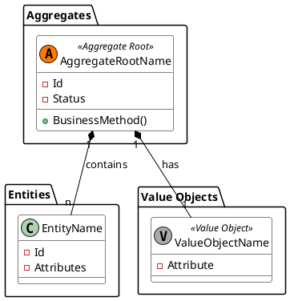

# Domain Model: [Bounded Context Name]

**Bounded Context:** [Name]  
**Main Responsibility:** [One clear sentence]  
**Version:** 1.0.0

## Ubiquitous language

| Term | Definition | Example |
|---|---|---|
| AggregateRoot | [Business definition] | [Concrete example] |
| Entity | [Business definition] | [Concrete example] |

## Tactical design

### Aggregate roots

- **`AggregateRootName`**: brief description and main invariants it protects.

### Entities

- **`EntityName`**: internal entity or related to the aggregate root.

### Value objects

- **`EmailAddress`**: validations and behavior.
- **`DateRange`**: prevents invalid ranges.

### Domain services

- **`[Name]Service`**: coordinates rules that don't naturally belong to a single entity.

### Domain events

- `EntityCreatedDomainEvent`: description and known consumers.
- `EntityUpdatedDomainEvent`: description and known consumers.

## Business rules

1. [Main aggregate invariant].
2. [Uniqueness or consistency constraint].
3. [Temporal, hierarchical, or contractual rule].

## Modeling notes

- Clearly define which concepts belong to this bounded context and which do not.
- Explain any reference to other modules without breaking domain autonomy.
- If there are delicate decisions, link to the corresponding ADR.

## Diagrams

Include only diagrams that help understand the model. If they don't add clarity, omit them.

[back](./readme.md)
