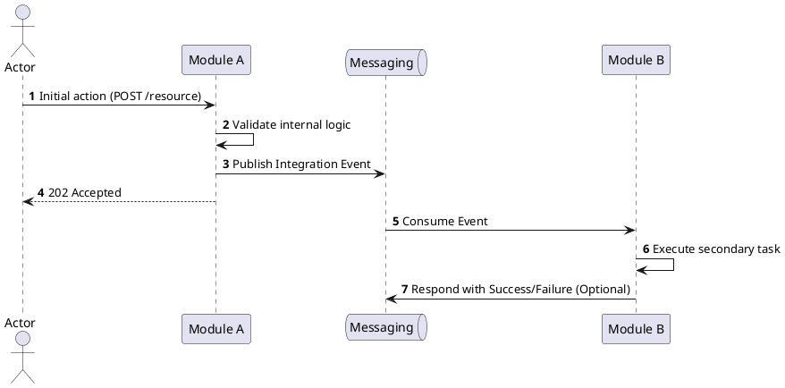

# Template: Sequence Diagram

## Flow: [Process Name]

```plantuml
@startuml
autonumber
actor "Actor" as A
participant "Module A" as MA
queue "Messaging" as bus
participant "Module B" as MB

A -> MA: Initial action (POST /resource)
MA -> MA: Validate internal logic
MA -> bus: Publish Integration Event
MA --> A: 202 Accepted

bus -> MB: Consume Event
MB -> MB: Execute secondary task
MB -> bus: Respond with Success/Failure (Optional)
@enduml
```

## Scenario description

Explain briefly what happens in this flow and why it is important to the system.

[back](../diagram-conventions.md)
