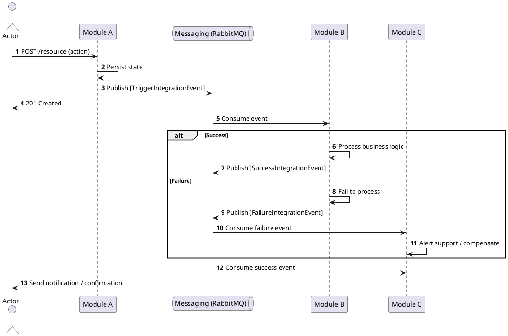

# Global Process 01: [Process Name]

## Objective

Describe the end-to-end flow from [triggering event] to [final outcome].

## Participating modules

- **{{MODULE_A}}:** [role in this process].
- **{{MODULE_B}}:** [role in this process].
- **{{MODULE_C}}:** [role in this process, e.g., handles outbound notifications].

## Main flow

### 1. [First step name]

- **Actor:** [human actor or system]
- **Module:** `[module-slug]`
- **Related use case:** `UC-CTX-01: [Use Case Name]`

[Description of what happens in this step and what gets triggered.]

### 2. [Second step name]

- **Actor:** system
- **Module:** `[module-slug]`
- **Related use cases:**
  - `UC-CTX-02: [Use Case Name]`

[Description of what happens. Include alternative scenarios if relevant.]

### 3. [Third step name]

- **Actor:** [actor]
- **Module:** `[module-slug]`
- **Related use case:** `UC-CTX-03: [Use Case Name]`

[Description of what happens in this step.]

## Sequence diagram

## Expected outcome

When the process completes:

- [outcome 1]
- [outcome 2]
- [outcome 3]

## Risks and considerations

- If [module] fails to [action], it must emit a failure event to alert support, without reverting [previous module] state.
- If [notification or delivery] fails, the system must allow retries or operational escalation.
- The entire flow must be auditable through `correlationId`.
