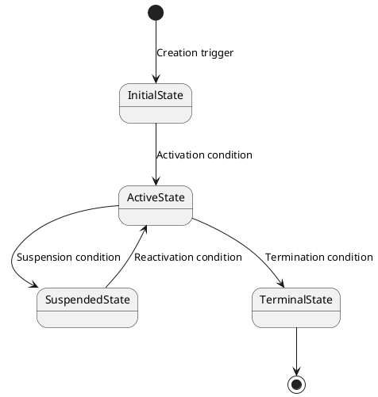

# Domain Model: {{MODULE_NAME}}

**Bounded Context:** {{BOUNDED_CONTEXT_DESCRIPTION}}  
**Main Responsibility:** {{MODULE_MAIN_RESPONSIBILITY}}  
**Version:** 1.0.0

## Ubiquitous language

| Term | Definition | Example |
|---|---|---|
| {{TERM_1}} | {{DEFINITION_1}} | {{EXAMPLE_1}} |
| {{TERM_2}} | {{DEFINITION_2}} | {{EXAMPLE_2}} |
| {{TERM_3}} | {{DEFINITION_3}} | {{EXAMPLE_3}} |

## Tactical design

### Aggregate roots

- **`{{AGGREGATE_ROOT}}`**: main aggregate root. Protects {{MAIN_INVARIANTS}}.
  - *State Machine (if applicable):*



  - *Concurrency handling (if applicable):* Owns a `Version` attribute. On concurrent writes, if the database version differs from the in-memory loaded version, an `OptimisticConcurrencyException` is thrown.

- **`{{SECOND_AGGREGATE}}`** (if applicable): aggregate root for {{SECOND_AGGREGATE_PURPOSE}}.

### Entities

- **`{{ENTITY_1}}`**: belongs to the `{{AGGREGATE_ROOT}}` aggregate. Records {{ENTITY_PURPOSE}}.
  - Identifier: `{{ENTITY_1}}Id`
  - Attributes: `{{ATTR_1}}`, `{{ATTR_2}}`.

### Value objects

- **`{{VALUE_OBJECT_1}}`**: encapsulates {{VALUE_OBJECT_1_PURPOSE}}.
- **`{{VALUE_OBJECT_2}}`**: validated {{VALUE_OBJECT_2_PURPOSE}}.
- **`{{PRIMARY_ID}}`**: immutable technical identifier.

### Domain services

- **`{{SERVICE_NAME}}Service`**: coordinates rules that don't naturally belong to a single entity.

### Domain events

- `{{AGGREGATE_ROOT}}CreatedDomainEvent`
- `{{AGGREGATE_ROOT}}UpdatedDomainEvent`
- `{{AGGREGATE_ROOT}}DeletedDomainEvent`

## Tactical model (Class diagram)

```plantuml
@startuml

skinparam class {
    Background ColorWhite
    ArrowColor Black
    BorderColor Black
}

package "Aggregates" {
    class {{AGGREGATE_ROOT}} << (A,#FF7700) Aggregate Root >> {
        - {{PRIMARY_ID}}
        - Status
        + BusinessMethod()
    }
}

package "Entities" {
    class {{ENTITY_1}} {
        - {{ENTITY_1}}Id
        - Attributes
    }
}

package "Value Objects" {
    class {{VALUE_OBJECT_1}} << (V,#AAAAAA) Value Object >> {
        - Attribute
    }
}

{{AGGREGATE_ROOT}} "1" *-- "n" {{ENTITY_1}} : contains
{{AGGREGATE_ROOT}} "1" *-- "1" {{VALUE_OBJECT_1}} : has
@enduml
```

## Business rules

1. No two `{{AGGREGATE_ROOT}}` can share the same `{{UNIQUE_FIELD}}`.
2. {{BUSINESS_RULE_2}}
3. {{BUSINESS_RULE_3}}

## Modeling notes

- `{{MODULE_NAME}}` is the source of truth for {{WHAT_IT_OWNS}}.
- This module does NOT manage {{WHAT_IT_DOES_NOT_OWN}}; that belongs to {{OTHER_MODULE}}.
- Integrations to other modules must go through business events, not direct access to persistence.

[back](./readme.md)
