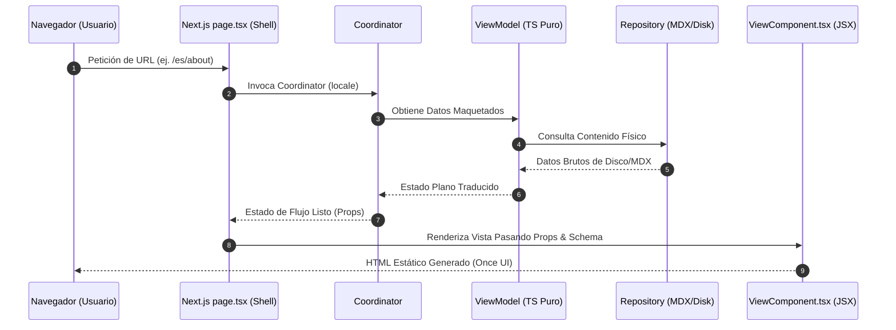

# Estándar de Estructura de Módulos y Mapeo de Vistas (MVVM-C)

Este estándar técnico define la organización estructural rígida que debe cumplir cada módulo del portafolio. Establece un desacoplamiento absoluto entre la lógica de negocio, la provisión de datos localizados y el motor de presentación visual.

---

## 1. Regla de Oro del Desarrollo Modular

> [!IMPORTANT]
> **El único punto de entrada en Next.js para el contenido de secciones es el catch-all `src/app/[locale]/[...slug]/page.tsx`.**
> Este shell es el único archivo bajo `src/app/[locale]/` (además del `page.tsx` de Home). Las vistas visuales de cada sección (About, Blog, Gallery, Work) residen en `src/proto-pages/` como Server Components puros desacoplados de Next.js. Ningún JSX de maquetación, llamada a i18n ni coordinador de negocio existe en el shell; todo se delega.

---

## 2. Mapa de Asociación por Módulo

El portafolio se divide en **4 contextos acotados principales** (módulos). Cada uno tiene un mapeo rígido entre su lógica de negocio y su vista de presentación, orquestados por el shell catch-all universal:

| Módulo (Negocio / Datos) | Vista Reutilizable (Proto-Page) | Shell Universal (Next.js) | Archivo i18n de Sección |
|---|---|---|---|
| **`src/modules/site`** | `HomeView.tsx` | `src/app/[locale]/page.tsx` *(único shell propio)* | `lang/[es/en]/home/page.json` |
| **`src/modules/about`** | `src/proto-pages/about/page.tsx` | `src/app/[locale]/[...slug]` → pageId `"about"` | `lang/[es/en]/about/page.json` |
| **`src/modules/about`** | `src/proto-pages/gallery/page.tsx` | `src/app/[locale]/[...slug]` → pageId `"gallery"` | `lang/[es/en]/gallery/page.json` |
| **`src/modules/blog`** | `src/proto-pages/blog/page.tsx`<br>`src/proto-pages/blog/post/page.tsx` | `src/app/[locale]/[...slug]` → pageId `"blog"` | `lang/[es/en]/blog/page.json` |
| **`src/modules/work`** | `src/proto-pages/work/page.tsx`<br>`src/proto-pages/work/post/page.tsx` | `src/app/[locale]/[...slug]` → pageId `"work"` | `lang/[es/en]/work/page.json` |

---

## 3. Anatomía Estándar de un Módulo

Cada módulo se compone de tres pilares ubicados en diferentes directorios del monorepo. Para añadir o modificar una sección de la aplicación, se debe cumplir esta estructura de carpetas:

```text
src/
├── app/[locale]/[...slug]/
│   └── page.tsx                         # 1. EL SHELL UNIVERSAL (Next.js Catch-All)
│                                        #    Resuelve PageRouter → carga proto-page correspondiente
│
├── proto-pages/[nombre-seccion]/
│   └── page.tsx                         # 2. LA PROTO-PAGE (Server Component puro)
│                                        #    Vista desacoplada del router de Next.js
│
├── components/layout-components/
│   └── [Nombre]View.tsx                 # 3. LA VISTA (React Component reutilizable)
│                                        #    Maquetación visual pura con Once UI
│
├── modules/[nombre-modulo]/             # 4. EL NEGOCIO (MVVM-C)
│   ├── domain/
│   │   └── types.ts                     # Interfaces y contratos del dominio
│   ├── infrastructure/
│   │   └── [nombre]Repository.ts        # Persistencia (MDX en proto-pages/...)
│   └── presentation/
│       ├── [nombre]Coordinator.ts       # Orquestador de flujos y navegación
│       └── viewModels/
│           └── [nombre]ViewModel.ts     # Transformador puro de datos
│
├── shared/routing/
│   └── PageRouter.ts                    # 5. MAPA DE RUTAS (Singleton de URLs localizadas)
│                                        #    esMap / enMap / idMap / resolveRoute() / getLocalizedSlug()
│
└── shared/slug/
    └── SlugRegistry.ts                  # 6. REGISTRO MDX (Slugs localizados desde frontmatter)
                                         #    slugs: { es: "...", en: "..." } → pageId canónico
```

---

## 4. Responsabilidades Rígidas por Capa

### A. El Shell Universal / Catch-All (`src/app/[locale]/[...slug]/page.tsx`)
- **Función**: Actúa como único punto de delegación entre Next.js y el sistema de vistas.
- **Acciones Permitidas**:
  - Resolver parámetros asíncronos de Next.js (`params`: `locale` + `slug[]`).
  - Invocar a `PageRouter.resolveRoute()` para determinar el `pageId` y si hay `contentSlug`.
  - Generar metadatos SEO dinámicos (`generateMetadata`) importando lazily la proto-page.
  - Renderizar el schema semántico JSON-LD (`<Schema />`).
  - Importar dinámicamente la proto-page correcta del `PAGE_REGISTRY`.
  - Declarar `generateStaticParams()` emitiendo todas las combinaciones de idioma + slug.
- **Prohibido**: JSX complejo de maquetación, llamadas directas a i18n o al filesystem (`fs`).

### B. La Proto-Page (`src/proto-pages/[seccion]/page.tsx`)
- **Función**: Componente React Server puro que actúa como punto de composición de la sección, desacoplado de la estructura física del router de Next.js.
- **Acciones Permitidas**:
  - Recibir `locale` y opcionalmente `contentSlug` como props.
  - Invocar al Coordinator del módulo pasándole el locale y/o slug.
  - Renderizar el componente View correspondiente pasándole el estado del ViewModel.
  - Exportar `generateMetadata` para que el catch-all lo invoque lazily.
- **Prohibido**: Interactuar con el filesystem o importar librerías de infraestructura (`fs`, `gray-matter`).

### C. La Vista de Presentación (`src/components/layout-components/...`)
- **Función**: Renderizar la interfaz interactiva usando Once UI y maquetación visual adaptativa.
- **Acciones Permitidas**:
  - Recibir todos los datos tipados como `props`.
  - Contener interacción de interfaz (estados de cliente, animaciones, grids responsivos).
  - Invocar a otros componentes visuales comunes del sistema (como `<Posts />`, `<Projects />` o `<RenderHTML />`).
- **Prohibido**: Importar librerías de Next.js de servidor, usar gray-matter, interactuar con el filesystem o leer variables de entorno dinámicas.

### D. La Lógica de Negocio (`src/modules/...`)
- **Domain**: Define los tipos de datos puros libres de frameworks. Las entidades `BlogPost` y `Project` incluyen el campo `slugs?: Record<string, string>` para el soporte de slugs localizados.
- **Infrastructure**: Implementa los repositorios físicos (lectura de MDX desde `src/proto-pages/*/posts|projects/`) aislados de la UI.
- **Presentation (ViewModels)**: Funciones TypeScript puras (`.ts`). Toman datos brutos del repositorio, resuelven el slug localizado vía `SlugRegistry` y traducciones de i18n, y entregan un estado plano/serializado óptimo para renderizar.
- **Presentation (Coordinators)**: Resuelven los flujos dinámicos (como decidir si mostrar una vista de detalle, redireccionar, o gatillar un `notFound()` de Next.js).

### E. El Sistema de Enrutamiento Localizado (`src/shared/routing/` y `src/shared/slug/`)
- **PageRouter**: Singleton que centraliza el mapeo `pageId` ↔ slug localizado para las secciones estáticas del sitio (ej. `"about"` → `"sobre-mi"` / `"about-me"`).
- **SlugRegistry**: Registro dinámico que construye el mapeo de slugs para el contenido MDX (posts y proyectos) a partir del campo `slugs: { es, en }` del frontmatter.

---

## 5. Diagrama de Flujo de Datos del Estándar


