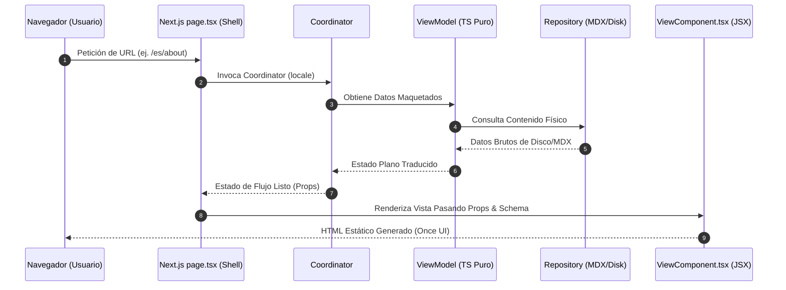

# Estándar de Estructura de Módulos y Mapeo de Vistas (MVVM-C)

Este estándar técnico define la organización estructural rígida que debe cumplir cada módulo del portafolio. Establece un desacoplamiento absoluto entre la lógica de negocio, la provisión de datos localizados y el motor de presentación visual.

---

## 1. Regla de Oro del Desarrollo Modular

> [!IMPORTANT]
> **Toda página o ruta física de Next.js (`page.tsx`) es únicamente un cascarón vacío de orquestación (Thin-Shell).**
> Ningún archivo bajo `src/app/` debe contener JSX interactivo de dominio, ni maquetaciones de layouts, ni llamadas directas de i18n (`getDictionary`). Todo el renderizado se delega a un **View Component** dedicado bajo `src/components/` pasando los datos como `props`.

---

## 2. Mapa de Asociación por Módulo

El portafolio se divide en **4 contextos acotados principales** (módulos). Cada uno tiene un mapeo rígido uno-a-uno entre sus capas de lógica, vistas y rutas físicas:

| Módulo (Negocio / Datos) | Vista Reutilizable (UI Pura) | Ruta Asociada (Shell Next.js) | Archivo i18n de Rutas |
|---|---|---|---|
| **`src/modules/site`** | `HomeView.tsx` | `src/app/[locale]/page.tsx` | `lang/[es/en]/home/page.json` |
| **`src/modules/about`** | `AboutView.tsx` | `src/app/[locale]/about/page.tsx` | `lang/[es/en]/about/page.json` |
| **`src/modules/about`** | `GalleryView.tsx` | `src/app/[locale]/gallery/page.tsx` | `lang/[es/en]/gallery/page.json` |
| **`src/modules/blog`** | `BlogListView.tsx`<br>`BlogPostView.tsx` | `src/app/[locale]/blog/page.tsx`<br>`src/app/[locale]/blog/[...slug]/page.tsx` | `lang/[es/en]/blog/page.json` |
| **`src/modules/work`** | `WorkListView.tsx`<br>`WorkDetailView.tsx` | `src/app/[locale]/work/page.tsx`<br>`src/app/[locale]/work/[...slug]/page.tsx` | `lang/[es/en]/work/page.json` |

---

## 3. Anatomía Estándar de un Módulo

Cada módulo se compone de tres pilares ubicados en diferentes directorios del monorepo. Para añadir o modificar una sección de la aplicación, se debe cumplir esta estructura de carpetas:

```text
src/
├── app/[locale]/[nombre-ruta]/
│   └── page.tsx                         # 1. EL SHELL (Next.js Page)
│
├── components/[nombre-modulo]/
│   └── [Nombre]View.tsx                 # 2. LA VISTA (React Component)
│
├── modules/[nombre-modulo]/             # 3. EL NEGOCIO (MVVM-C)
│   ├── domain/
│   │   └── types.ts                     # Interfaces y contratos del dominio
│   ├── infrastructure/
│   │   └── [nombre]Repository.ts        # Persistencia (MDX / API)
│   └── presentation/
│       ├── [nombre]Coordinator.ts       # Orquestador de flujos y navegación
│       └── viewModels/
│           └── [nombre]ViewModel.ts     # Transformador puro de datos
```

---

## 4. Responsabilidades Rígidas por Capa

### A. La Ruta / Shell (`src/app/[locale]/...`)
- **Función**: Actúa como puente con Next.js y el servidor.
- **Acciones Permitidas**:
  - Resolver parámetros asíncronos de Next.js (`params`).
  - Generar metadatos SEO dinámicos (`generateMetadata`).
  - Renderizar scripts estructurales de SEO semántico (`<Schema />`).
  - Invocar al Coordinator del módulo pasándole el locale actual.
  - Llamar al componente visual de Vista pasándole el estado serializado del ViewModel.
- **Prohibido**: Renderizar JSX complejo de maquetación, realizar llamadas directas a i18n o interactuar con el filesystem (`fs`).

### B. La Vista de Presentación (`src/components/...`)
- **Función**: Renderizar la interfaz interactiva usando Once UI y maquetación visual adaptativa.
- **Acciones Permitidas**:
  - Recibir todos los datos tipados como `props`.
  - Contener interacción de interfaz (estados de cliente, animaciones, grids responsivos).
  - Invocar a otros componentes visuales comunes del sistema (como `<Posts />`, `<Projects />` o `<RenderHTML />`).
- **Prohibido**: Importar librerías de Next.js de servidor, usar gray-matter, interactuar con el filesystem o leer variables de entorno dinámicas.

### C. La Lógica de Negocio (`src/modules/...`)
- **Domain**: Define los tipos de datos puros libres de frameworks.
- **Infrastructure**: Implementa los repositorios físicos (lectura de MDX, mapeos y parsing) aislados de la UI.
- **Presentation (ViewModels)**: Funciones TypeScript puras (`.ts`). Toman datos brutos del repositorio y traducciones de i18n, y entregan un estado plano/serializado óptimo para renderizar. No importan nada de React ni JSX.
- **Presentation (Coordinators)**: Resuelven los flujos dinámicos (como decidir si mostrar una vista de detalle, redireccionar, o gatillar un `notFound()` de Next.js).

---

## 5. Diagrama de Flujo de Datos del Estándar


