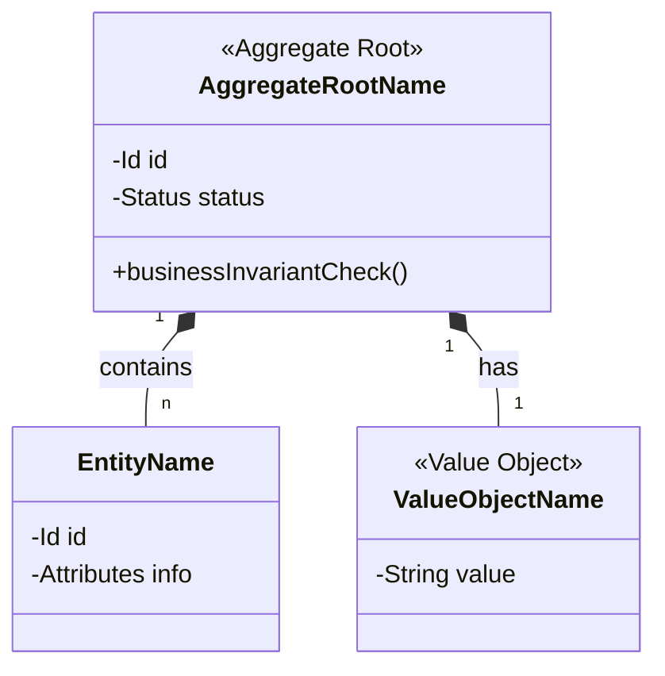

# Template: Domain Model Diagram

This template outlines standard tactical relationships between Aggregate Roots, Entities, and Value Objects inside a Bounded Context.

## Tactical Model

## Model Explanation

Use this section to explain the main invariants (business rules) that the Aggregate Root protects and clarify tactical design choices.

[back](../diagram-conventions.md)
