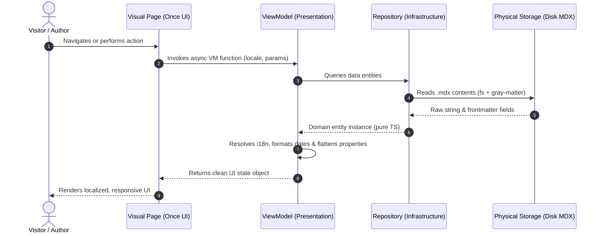

# Template: Sequence Diagram

This template outlines how time-ordered interactions between MVVM layers and technical components should be visualized using Mermaid sequence syntax.

## Flow: [Process Name]

## Scenario Description

Briefly describe the business and technical purpose of this flow, its triggers, preconditions, and postconditions.

[back](../diagram-conventions.md)
