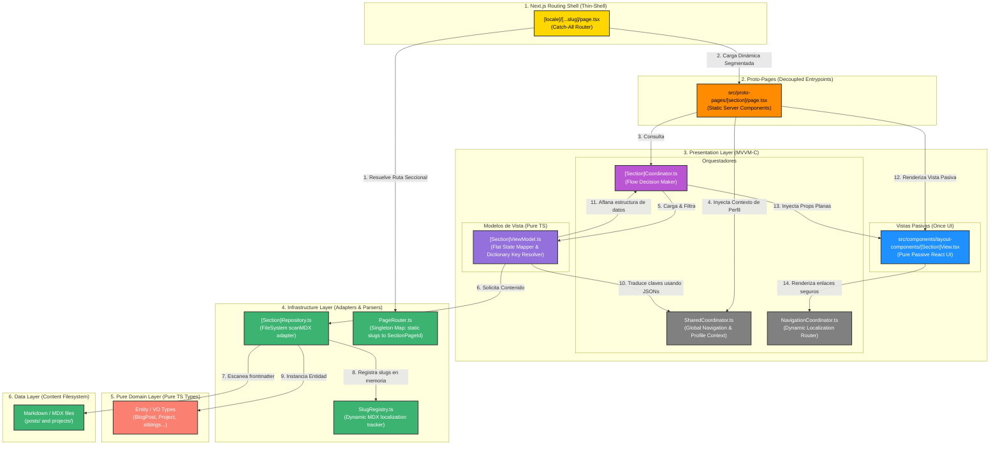
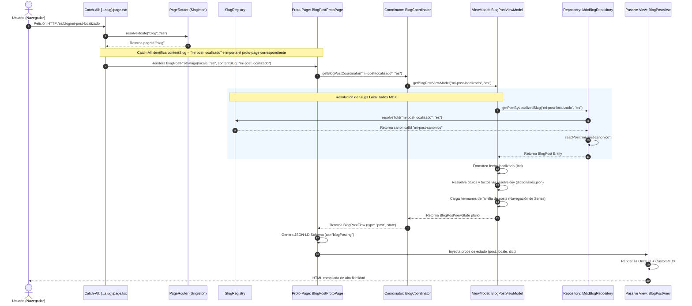

# 🗺️ Visual Architecture Map — Herman's Personal Page

Este documento provee una representación visual interactiva de alta fidelidad de la arquitectura del portafolio. Muestra las interacciones entre los componentes del sistema, el flujo de enrutamiento localizado y la organización de capas del patrón **DDD + MVVM-C** sobre la infraestructura **Once UI**.

---

## 🏛️ 1. Capas del Sistema (DDD + MVVM-C + Next.js)

El monorepo separa rígidamente la lógica de negocio pura de la infraestructura de enrutamiento y la maquetación visual de cliente:

---

## 🌍 2. Flujo de Enrutamiento Semántico Localizado

El sistema implementa una resolución bidireccional y bilingüe de slugs para garantizar URLs nativas independientes (ej: `/es/portafolio/personal-page/dependencies/` y `/en/work/personal-page/dependencies/` resolviendo al mismo contenido físico):

---

## 📂 3. Anatomía Estructural del Código Fuente (`src/`)

Organización física completa del código fuente de acuerdo con los límites de contextos y fronteras arquitectónicas del monorepo:

```mermaid
graph TD
    classDef folder fill:#2F4F4F,stroke:#fff,stroke-width:1px,color:#fff;
    classDef file fill:#E6F2FF,stroke:#333,stroke-width:1px,color:#000;

    Src["src/"]:::folder
    Api["api-backup/ [Legacy Endpoint]"]:::folder
    App["app/ [Routing Shells]"]:::folder
    Comp["components/ [UI & Passive Views]"]:::folder
    Mod["modules/ [MVVM-C Business Contexts]"]:::folder
    Proto["proto-pages/ [Server Pages & MDX]"]:::folder
    Res["resources/ [Settings]"]:::folder
    Scripts["scripts/ [RSS Compiler]"]:::folder
    Shared["shared/ [Transversal Core]"]:::folder
    Types["types/ [Generic Types]"]:::folder
    Utils["utils/ [FileSystem Parsers]"]:::folder

    Src --> Api
    Src --> App
    Src --> Comp
    Src --> Mod
    Src --> Proto
    Src --> Res
    Src --> Scripts
    Src --> Shared
    Src --> Types
    Src --> Utils

    %% App Subtree
    App --> AppRoot["(root)/ [Redirection]"]:::folder
    App --> AppLocale["[locale]/ [Universal Shell]"]:::folder
    AppLocale --> AppSlug["[...slug]/page.tsx"]:::file
    AppLocale --> AppHome["page.tsx [Home]"]:::file
    AppLocale --> AppLayout["layout.tsx [Global Shell]"]:::file

    %% Components Subtree
    Comp --> Layouts["layout-components/ [Views]"]:::folder
    Layouts --> ViewHome["HomeView.tsx"]:::file
    Layouts --> ViewAbout["AboutView.tsx"]:::file
    Layouts --> ViewBlog["BlogListView.tsx"]:::file
    Layouts --> ViewBlogPost["BlogPostView.tsx"]:::file
    Layouts --> ViewGallery["GalleryView.tsx"]:::file
    Layouts --> ViewWorkList["WorkListView.tsx"]:::file
    Layouts --> ViewWorkDetail["WorkDetailView.tsx"]:::file
    Comp --> RouteGuard["RouteGuard.tsx"]:::file
    Comp --> RenderHTML["RenderHTML.tsx"]:::file

    %% Modules Subtree
    Mod --> ModAbout["about/presentation/aboutCoordinator.ts"]:::file
    Mod --> ModBlog["blog/"]:::folder
    ModBlog --> ModBlogDom["domain/Post.ts"]:::file
    ModBlog --> ModBlogInf["infrastructure/mdxRepository.ts"]:::file
    ModBlog --> ModBlogPres["presentation/ [blogCoordinator.ts + viewModels/]"]:::folder
    Mod --> ModSite["site/presentation/ [siteCoordinator.ts + viewModels/]"]:::folder
    Mod --> ModWork["work/"]:::folder
    ModWork --> ModWorkDom["domain/Project.ts"]:::file
    ModWork --> ModWorkInf["infrastructure/projectRepository.ts"]:::file
    ModWork --> ModWorkPres["presentation/ [workCoordinator.ts + viewModels/]"]:::folder

    %% Proto Subtree
    Proto --> ProtoAbout["about/page.tsx"]:::file
    Proto --> ProtoGallery["gallery/page.tsx"]:::file
    Proto --> ProtoBlog["blog/"]:::folder
    ProtoBlog --> ProtoBlogList["page.tsx"]:::file
    ProtoBlog --> ProtoBlogPost["post/page.tsx"]:::file
    ProtoBlog --> ProtoBlogPosts["posts/ [.mdx content]"]:::folder
    Proto --> ProtoWork["work/"]:::folder
    ProtoWork --> ProtoWorkList["page.tsx"]:::file
    ProtoWork --> ProtoWorkDetail["post/page.tsx"]:::file
    ProtoWork --> ProtoWorkProjects["projects/ [.mdx content]"]:::folder

    %% Shared Subtree
    Shared --> SharedCoord["coordinator/ [sharedCoordinator.ts + navigationCoordinator.ts]"]:::folder
    Shared --> SharedI18n["i18n/ [dictionaries.ts + lang/]"]:::folder
    Shared --> SharedRouting["routing/PageRouter.ts"]:::file
    Shared --> SharedSlug["slug/SlugRegistry.ts"]:::file
    Shared --> SharedUI["ui/components/ [mdx.tsx + T.tsx]"]:::file
```

---

## ⚡ 4. Ciclo de Generación Estática (Build & Sindicación)

Dado que la aplicación compila estáticamente al 100% (`output: 'export'`), toda la sindicación RSS y resoluciones de rutas ocurren de forma offline en pre-build:

```mermaid
stateDiagram-v2
    [*] --> Fase_Prebuild : npm run build
    
    state Fase_Prebuild {
        [*] --> Run_RSS_Script : Ejecuta generate-rss.ts
        Run_RSS_Script --> Escaneo_MDX_Offline : Carga getBlogListViewModel()
        Escaneo_MDX_Offline --> Escribir_RSS_XML : Genera feed bilingüe
        Escribir_RSS_XML --> Guardar_Public : Escribe rss-es.xml y rss-en.xml en public/
        Guardar_Public --> [*]
    }

    Fase_Prebuild --> Fase_NextJS_Build
    
    state Fase_NextJS_Build {
        [*] --> Compilar_TypeScript : npx tsc
        Compilar_TypeScript --> Resolver_Metadatos_SSG : Carga dynamic="force-static" para robots.txt y sitemap.xml
        Resolver_Metadatos_SSG --> Resolucion_Rutas_SSG : Invoca generateStaticParams() en [...slug]/page.tsx
        Resolucion_Rutas_SSG --> Escaneo_Permutaciones : Mapea permutaciones de idiomas y slugs dinámicos vía Repositorios y Registries
        Escaneo_Permutaciones --> Compilacion_HTML : Next.js exporta páginas HTML a out/
        Compilacion_HTML --> Copiar_Assets : Copia assets de public/ (incluyendo RSS) a out/
        Copiar_Assets --> [*]
    }

    Fase_NextJS_Build --> HTML_Estatico_CDN : out/ generado listo para producción
    HTML_Estatico_CDN --> GitHub_Actions_Pipeline : Push a la rama 'publish'
    
    state GitHub_Actions_Pipeline {
        [*] --> Setup_Runner : Inicializa Node.js 20 & Restaura caché (.next/cache)
        Setup_Runner --> Inject_Secrets : Configura NEXT_PUBLIC_PAGE_ACCESS_PASSWORD
        Inject_Secrets --> Build_Runner : Corre compilación estática
        Build_Runner --> Deploy_GH_Pages : Publica el directorio out/ en GitHub Pages
        Deploy_GH_Pages --> [*]
    }
    
    GitHub_Actions_Pipeline --> [*] : Despliegue Exitoso
```

---

> [!NOTE]
> Esta representación interactiva consolida la verdad arquitectónica del proyecto. Cualquier cambio en las fronteras de los módulos o flujos de enrutamiento localizado debe sincronizarse con este documento visual para mantener la higiene documental del monorepo.
