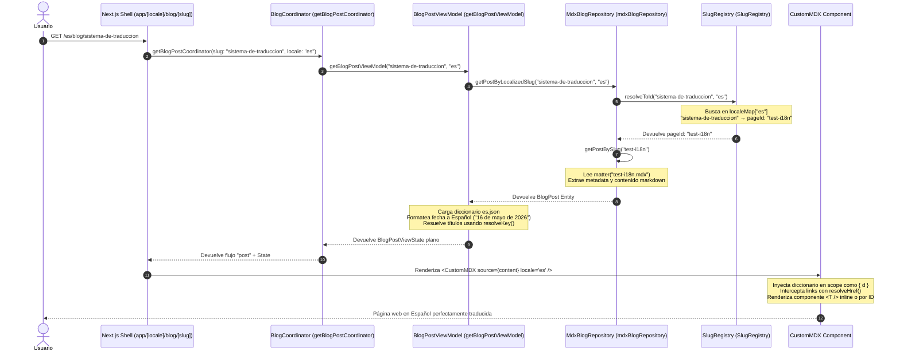

# Ciclo de Vida de Internacionalización (i18n) para un Post de Blog

Este documento explica de forma detallada la arquitectura y el ciclo de vida que sigue el motor de internacionalización (i18n) en **Herman's Personal Page** cuando un usuario solicita y visualiza un post de blog.

El sistema está diseñado bajo principios de **DDD (Domain-Driven Design) + MVVM-C (Model-View-ViewModel-Coordinator)**, desacoplado de las librerías tradicionales de Next.js mediante un motor estricto, bilingüe y tipado.

---

## 1. Arquitectura General de i18n

El motor de traducción opera en tres capas conceptuales:
1. **Diccionarios JSON Modulares** (`src/shared/i18n/lang/`): Diccionarios estáticos estructurados por namespace (`common.json`, `blog.json`, etc.) y validados por tipado estricto (`as const`).
2. **Base de Datos MDX Semántica** (`src/proto-pages/blog/posts/`): Contenido de los artículos escrito en formato MDX con soporte para traducción inline, traducción por clave e inyección directa de variables.
3. **Resolución en Build-Time y Run-Time** (`SlugRegistry` + `ViewModel`): Vinculación dinámica de rutas en español e inglés hacia archivos físicos canónicos sin duplicidad de contenido.

---

## 2. Diagrama del Ciclo de Vida (Flujo de Orquestación)

El siguiente diagrama de secuencia ilustra cómo se transforma una petición HTTP en un renderizado traducido final:



---

## 3. Desglose Paso a Paso del Ciclo

### Paso 1: Definición Física en MDX y Metadatos Localizados
Cada post de blog se escribe en un único archivo `.mdx` bajo `src/proto-pages/blog/posts/`. El frontmatter contiene las claves de configuración y la metadata del artículo.

```yaml
---
title: "blog.posts.test.title"       # Puede ser un ID de traducción o texto plano
summary: "blog.posts.test.summary"   # Puede ser un ID de traducción o texto plano
publishedAt: "2026-05-16"
tag: "Legacy"
slugs:                               # Mapeo explícito de URLs bilingües
  es: "sistema-de-traduccion"
  en: "translation-system"
---
```

### Paso 2: Registro de Slugs en Build-Time (`SlugRegistry`)
Cuando se inicializa el servidor Next.js o se compila el sitio, el `MdxBlogRepository` escanea la carpeta de posts físicos y registra cada uno en el `SlugRegistry`.

El `SlugRegistry` construye dos mapas internos para evitar redundancia y posibilitar búsquedas instantáneas bidireccionales:
1. `localeMap`: Mapea un slug localizado e idioma a un identificador único (el nombre del archivo MDX sin extensión, e.g. `test-i18n`).
   - `es` -> `"sistema-de-traduccion"` $\rightarrow$ `test-i18n`
   - `en` -> `"translation-system"` $\rightarrow$ `test-i18n`
2. `idMap`: Almacena la relación inversa para resolver URLs correctas cuando el usuario cambia de idioma.

### Paso 3: Enrutamiento Dinámico y Captura por Next.js
Cuando el usuario visita la URL `/[locale]/blog/[slug]`, Next.js captura los parámetros de enrutamiento:
* `locale`: `"es"` o `"en"`
* `slug`: `"sistema-de-traduccion"`

### Paso 4: Transformación MVVM (`BlogPostViewModel`)
El `BlogPostViewModel` es el cerebro encargado de traducir, formatear y simplificar los datos antes de enviarlos a la vista:

1. **Resolución a Archivo Físico**:
   Llama a `mdxBlogRepository.getPostByLocalizedSlug(slug, locale)`. Éste consulta al `SlugRegistry` para traducir la ruta amigable al identificador físico (`test-i18n`), garantizando que Next.js lea exactamente el mismo archivo MDX independientemente del idioma de la URL.
   
2. **Carga de Diccionarios de Idioma**:
   Se carga el diccionario centralizado mediante `getDictionary(locale)`, fusionando namespaces específicos de la sección (`blog/page.json`, `ui.json`, `person.json`).

3. **Formateo Localizado de Fechas**:
   Utiliza la API nativa de JavaScript `Intl.DateTimeFormat(locale, ...)` para formatear dinámicamente la fecha de publicación:
   - Para `"es"`: `"16 de mayo de 2026"`
   - Para `"en"`: `"May 16, 2026"`

4. **Traducción de Metadatos (`resolveKey`)**:
   Llama a la función utilitaria `resolveKey(dict, post.metadata.title)`. Si el título en el frontmatter corresponde a una ruta dentro del JSON del diccionario (ej: `"blog.posts.test.title"`), recupera el valor traducido. Si no coincide con ninguna ruta, asume que es texto plano y lo devuelve directamente. Esto proporciona la flexibilidad de usar traducciones en base de datos centralizada o escribir metadatos directamente en el MDX.

5. **Resolución de Artículos Relacionados (Siblings)**:
   Si el post pertenece a una serie, resuelve los slugs localizados y títulos de los posts hermanos según el idioma activo para evitar links rotos.

### Paso 5: Renderizado MDX e Inyección Dinámica (`CustomMDX` & `<T />`)
Finalmente, la vista reutilizable `<BlogPostView>` pasa el contenido crudo del MDX al motor `<CustomMDX>` junto con las variables de contexto `locale` y `currentPath`.

`<CustomMDX>` orquesta 4 superpoderes de traducción directa:

#### 1. Inyección Dinámica del Diccionario (`scope`)
En tiempo de compilación de MDX, se pasa el diccionario al compilador como scope:
```tsx
scope={{ d: dictionary }}
```
Esto permite escribir variables de traducción directas dentro del cuerpo del Markdown:
```markdown
El stack tecnológico utilizado es: **{d.ui.techStack}**
```

#### 2. Componente de Traducción `<T />` por ID
Busca y renderiza una clave de traducción del diccionario modular:
```markdown
<T id="blog.test.title" />
```

#### 3. Componente de Traducción `<T />` Inline (Contenido Único)
Para párrafos muy específicos que no vale la pena declarar en archivos JSON globales, se puede traducir inline en el propio archivo MDX:
```markdown
<T 
  es="Esto es un párrafo escrito directamente en el archivo MDX." 
  en="This is a paragraph written directly in the MDX file." 
/>
```

#### 4. Fallback Híbrido Automático
Si se utiliza un ID dinámico que no existe en el diccionario o si se quiere garantizar una visualización por defecto si la traducción no está disponible en producción:
```markdown
<T id="llave.no.existente" es="Texto de fallback" />
```

#### 5. Localización Automática de Enlaces (`resolveHref`)
Un problema común de i18n es que los enlaces escritos dentro del Markdown apunten a la ruta por defecto (ej: `[Sobre Mí](/about)`), perdiendo el contexto del idioma. 

El componente `<CustomMDX>` sobreescribe la etiqueta estándar `<a>` con una función fábrica que corre `resolveHref`:
- **Enlaces Relativos** (`./` o `../`): Se resuelven dinámicamente contra la ruta del post actual (`currentPath`).
- **Enlaces Internos Absolutos** (`/about`): Se les inyecta automáticamente el idioma activo si no lo tienen (`/es/about` o `/en/about`).
- **Enlaces Externos o Fragmentos** (`http://...` o `#ancla`): Se conservan intactos.

---

## 4. Resumen de Flujos de Datos

* **Datos de Entrada**: Parámetros de ruta Next.js $\rightarrow$ `locale` ("es"), `slug` ("sistema-de-traduccion").
* **Datos de Procesamiento**: `test-i18n.mdx` + `es.json` $\rightarrow$ `BlogPostViewState` (títulos traducidos, fechas formateadas).
* **Renderizado de Salida**: HTML semántico de Once UI con textos, enlaces y metadatos perfectamente traducidos al español.
