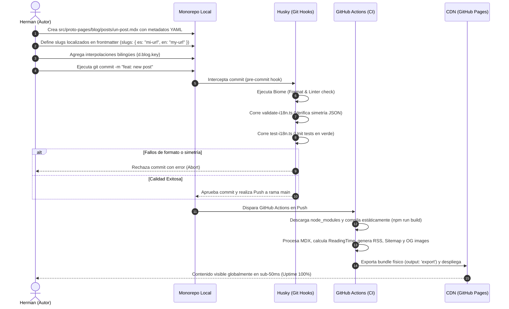

# Global Process 01: Publicación de Contenidos Técnicos (MDX)

## 🎯 Objective

Describir el flujo transversal de extremo a extremo que realiza el Autor para redactar, validar de forma automatizada, compilar sin dependencias de red y desplegar un nuevo artículo de blog o proyecto de portafolio comercial en producción.

---

## 🏛️ Participating Modules

- **`blog` / `work`**: Módulos dueños de la información. Almacenan los archivos `.mdx` físicos y exponen el frontmatter a través de los adaptadores de infraestructura correspondientes.
- **`site`**: Módulo integrador. Consume el contenido formateado por el ViewModel e inyecta la estructura visual de Once UI, autogenerando el `sitemap.xml` bilingüe en compilación.
- **`shared` (DevOps)**: Pipeline de compilación y calidad. Provee los Git Hooks (Husky, lint-staged), el validador Biome, y gestiona el flujo de integración continua (CI/CD) de GitHub Actions hacia la CDN.

---

## 📊 Sequence Diagram (Build & Deploy Flow)



---

## 📋 Main Flow (Paso a Paso)

### 1. Redacción Física del Artículo
- **Actor:** Autor (Herman)
- **Módulo:** `blog` o `work`
- **Acción:** Creación física del archivo `.mdx` en `src/proto-pages/blog/posts/` (blog) o `src/proto-pages/work/projects/` (work). Se definen las metadatos obligatorios en el frontmatter (invariante: `title`, `summary`, `publishedAt`, al menos un `tag`) y el campo de slugs localizados:
  ```yaml
  slugs:
    es: "mi-articulo-en-espanol"
    en: "my-article-in-english"
  ```
  Si el campo `slugs` se omite, el nombre del archivo actúa como slug universal (retrocompatibilidad).

### 2. Formateo y Verificación Local
- **Actor:** Husky (Git Hook)
- **Módulo:** `shared` (DevOps)
- **Acción:** Al realizar commit, `lint-staged` corre Biome para uniformar el formato (2 espacios). De forma inmediata, el script `validate-i18n.ts` verifica que los diccionarios idiomáticos mantengan la misma estructura simétrica en sus namespaces bilingües.

### 3. Compilación Estática y Offline (`npm run build`)
- **Actor:** GitHub Actions Runner
- **Módulo:** `site` / `shared`
- **Acción:** Next.js pre-compila el monorepo sin requerir llamadas dinámicas HTTP de red externa.
  - El motor MDX procesa los artículos inyectando el diccionario `d`.
  - Se genera de forma física el feed `rss/feed.xml` y `sitemap.xml` conteniendo todas las rutas bilingües localizadas.

### 4. Publicación en CDN Global
- **Actor:** CDN (GitHub Pages)
- **Acción:** Los archivos estáticos HTML/CSS se distribuyen a nivel global en servidores perimetrales.

---

## 🛡️ Risks and Considerations

- **Invariante Rígido de Frontmatter**: Si el Autor olvida declarar un metadato obligatorio (ej: `publishedAt`), la compilación estática fallará en tiempo de compilación de GitHub Actions, bloqueando el despliegue automático hacia producción para proteger el sitio final.
- **Resiliencia ante Claves Faltantes**: Si el post MDX referencia una clave `d.blog.key` inexistente en el JSON, el motor de fallbacks de 5 niveles degradará visualmente el valor a la clave textual cruda, permitiendo que la web renderice sin colapsar ni causar desfases de hidratación visual.

---

[back](./readme.md)
