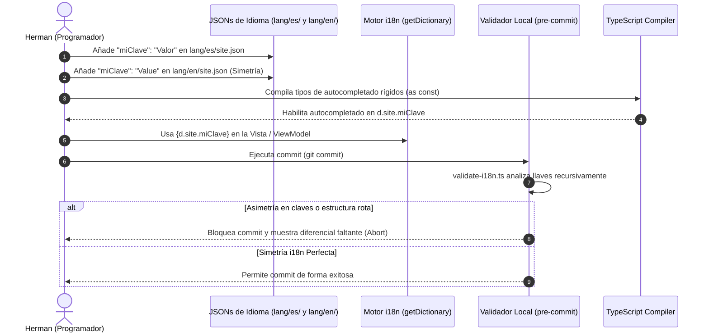

# Global Process 02: Actualización e Integración de Traducciones (i18n)

## 🎯 Objective

Describir el proceso transversal para añadir, modificar o eliminar etiquetas y namespaces de traducción bilingües en los diccionarios JSON del monorepo, asegurando la consistencia rígida de tipos TypeScript (`as const`) y previniendo caídas visuales o hidrataciones fallidas.

---

## 🏛️ Participating Modules

- **`shared` (i18n)**: Almacén físico bilingüe. Contiene los ficheros JSON estructurados por locales (`es` / `en`) y namespaces funcionales (como `site`, `blog`, `work`, `about`).
- **`site` (Engine i18n)**: Provee las utilidades del motor de traducción, incluyendo el componente `<T />`, la función de resolución dinámica `resolveKey` y la jerarquía de fallbacks de 5 niveles.
- **`blog` / `work` / `about`**: Consumidores directos. Los ViewModels de estos módulos invocan el cargador `getDictionary` inyectando el diccionario limpio a las vistas de Once UI.

---

## 📊 Sequence Diagram (Translation Sync Flow)

---

## 📋 Main Flow (Paso a Paso)

### 1. Identificación y Declaración de Etiqueta
- **Actor:** Programador (Herman)
- **Módulo:** `shared` (i18n)
- **Acción:** Identificar la sección que requiere localización. Crear o abrir los diccionarios JSON correspondientes en la ruta física `src/shared/i18n/lang/`.

### 2. Edición Simétrica Estricta
- **Actor:** Programador
- **Acción:**
  - Añadir la clave-valor en el archivo en Español (ej: `/es/site.json`).
  - Añadir la misma clave con el valor traducido en el archivo en Inglés (ej: `/en/site.json`).
  - *Invariante de Negocio:* Las claves y niveles de anidación deben ser exactamente idénticos en ambos ficheros.

### 3. Autocompletado de Tipos TypeScript (`as const`)
- **Actor:** Compilador de TypeScript
- **Acción:** El motor del monorepo mapea estáticamente los JSONs mediante tipados directos para que los IDEs proporcionen autocompletado inmediato y prevengan tipografías incorrectas en el código de las vistas.

### 4. Consumo en Componente o ViewModel
- **Actor:** Programador
- **Acción:** Cargar el namespace correspondiente a través de `getDictionary` en el ViewModel del módulo e inyectarlo en la vista Once UI.

---

## 🛡️ Risks and Considerations

- **Asimetría de Idiomas (Claves Faltantes)**: El script pre-commit `validate-i18n.ts` valida recursivamente la simetría de diccionarios. Si falta una clave en cualquiera de los dos idiomas, el commit es rechazado inmediatamente.
- **Ruptura Visual por Campos Nulos**: Si por razones de mantenimiento temporal falta una clave en producción, el motor de traducción `getNestedValue` aplica un algoritmo recursivo de fallback en 5 niveles, mostrando el valor en el idioma alternativo o, en su defecto, la clave literal cruda, protegiendo al layout Once UI de cualquier caída o deformación visual.

---

[back](./readme.md)
