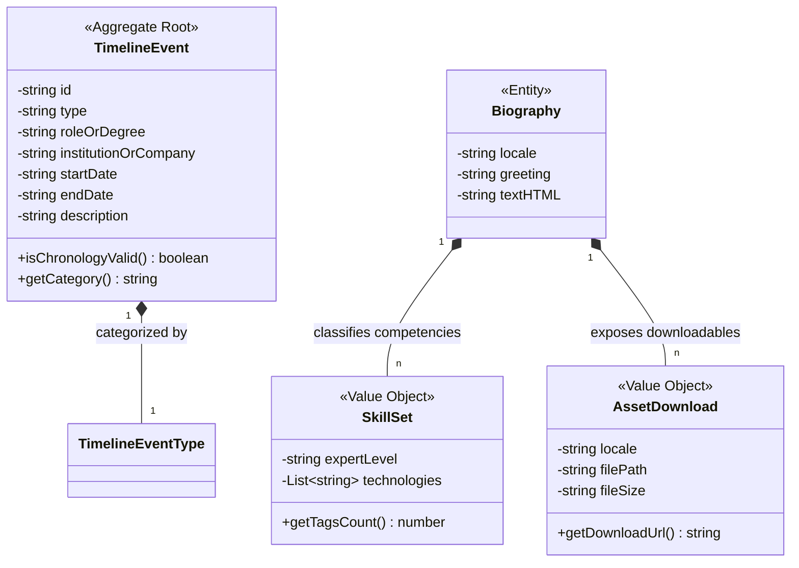

# Domain Model: About Module

**Bounded Context:** about  
**Main Responsibility:** Gestión del Perfil de Herman, Hitos Profesionales e Habilidades Técnicas.  
**Version:** 2.0.0

---

## Ubiquitous Language (Lenguaje Ubicuo)

| Term | Definition | Example |
|---|---|---|
| **TimelineEvent** | Hito laboral o académico cronológico individual que representa un escalón en la carrera de Herman. | `TimelineEvent(role: "Tech Lead")` |
| **Biography** | Resumen biográfico localizado e internacionalizado inyectado en Once UI. | `Biography("Diseñador de software...")` |
| **SkillSet** | Competencia técnica agrupada bajo taxonomías excluyentes de experticia. | `SkillSet(level: "Expert", tags: ["React"])` |
| **AssetDownload** | Archivo estático descargable localizado según el idioma del visitante. | `AssetDownload(locale: "es", filename: "CV.pdf")` |

---

## Tactical Design (Diseño Táctico)

### 1. Aggregate Roots

- **`TimelineEvent`**: Representa un hito individual en la línea de tiempo. Protege el invariante de consistencia cronológica de fechas y de categorización unívoca (`work` | `education`).

### 2. Value Objects

- **`SkillSet`**: Agrupación tipada que clasifica las habilidades de Herman en los tres niveles inmutables del sistema.
- **`AssetDownload`**: Encapsula el enlace local al Curriculum Vitae físico en PDF de forma localizada.

---

## Tactical Model (Class Diagram)

---

## Business Rules (Invariantes del Dominio)

1. **Categorización Mutuamente Excluyente**: Un `TimelineEvent` debe pertenecer de forma inequívoca al tipo `work` (experiencia laboral) o `education` (educación formal), no pudiendo existir eventos híbridos o indefinidos.
2. **Consistencia Cronológica**: Todo evento de línea de tiempo con fecha de término declarada debe garantizar que `startDate` <= `endDate` en formato de ordenación ISO.
3. **Mapeo de Habilidades Estricto**: Ninguna tecnología de `SkillSet` puede repetirse entre categorías de experticia (`Expert`, `Proficient`, `Familiar`), garantizando una clasificación unívoca del conocimiento del autor.

---

[back](./readme.md)
