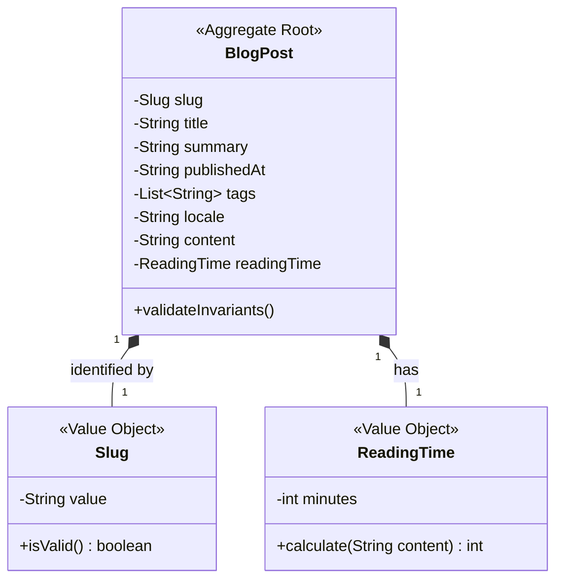

# Domain Model: Blog (Technical Writing)

**Bounded Context:** Blog & Content Management  
**Main Responsibility:** Model the domain lifecycle, properties, and validation rules of a technical post.  
**Version:** 1.0.0

---

## 🗣️ Ubiquitous Language

| Term | Definition | Example |
|---|---|---|
| **BlogPost** | Entidad de negocio que representa un artículo técnico redactado por el autor. | Un artículo detallando DDD en Next.js. |
| **Slug** | Identificador de cadena de texto amigable para URL que identifica de forma única al post. | `ddd-mvvm-architecture-nextjs` |
| **Frontmatter** | Bloque de metadatos estructurados en formato YAML ubicado en la parte superior del archivo físico MDX. | `title: "DDD", publishedAt: "2026-05-18"` |
| **Reading Time** | Duración aproximada de la lectura del artículo en minutos, calculada sobre la densidad de palabras del post. | `5 min` |
| **Tag** | Etiqueta técnica semántica utilizada para categorizar artículos y habilitar búsquedas temáticas. | `TypeScript`, `Once UI` |

---

## ⚙️ Tactical Design

### 1. Aggregate Roots

- **`BlogPost` (Aggregate Root)**: El núcleo del módulo. Centraliza todos los atributos de un post y protege los invariantes de formato, idioma y publicación.
  - **Attributes:**
    - `slug` (Slug): Identificador de URL seguro y único.
    - `title` (String): Título principal del post.
    - `summary` (String): Resumen sintético para listados y tarjetas.
    - `publishedAt` (String): Fecha de publicación del post.
    - `tags` (List): Clasificación de tecnologías.
    - `locale` (String): Idioma preferente ('es' | 'en').
    - `content` (String): Cuerpo completo del post en formato Markdown/JSX.
    - `readingTime` (ReadingTime): Valor calculado del tiempo de lectura.

---

### 2. Value Objects

- **`Slug`**: Encapsula el identificador de la URL. Valida de forma estricta que la cadena sea URL-safe (`^[a-z0-9-]+$`).
- **`ReadingTime`**: Calcula el tiempo de lectura basándose en el recuento del total de palabras del post físico dividido por una constante de lectura media (200 palabras por minuto).
  - *Fórmula:* `Math.ceil(wordsCount / 200)`

---

## 📊 Tactical Model (Class Diagram)

---

## 🛡️ Business Invariants (Domain Rules)

1. **Unicidad e Identidad**: Dos entidades `BlogPost` no pueden compartir el mismo `Slug` bajo el mismo idioma local.
2. **Formato Seguro**: Un `Slug` debe estar compuesto únicamente por minúsculas alfanuméricas y guiones medios. No se permiten caracteres especiales ni espacios.
3. **Mínimo de Clasificación**: Todo `BlogPost` debe tener al menos una etiqueta (`tag`) asignada para evitar posts huérfanos sin clasificación.
4. **Fechas Válidas**: La fecha `publishedAt` debe cumplir estrictamente con el formato ISO 8601 (`YYYY-MM-DD`).

---

## 📁 Modeling Notes

- **BlogPost** es la fuente de verdad del contenido técnico del portafolio.
- El módulo de **Blog** no gestiona la lógica de proyectos de trabajo o portafolio comercial; eso pertenece enteramente al módulo **Work**.
- La inyección del diccionario local se coordina a nivel del presentador (ViewModel) para no acoplar la entidad de dominio con estructuras de i18n variables.

---

[back](./readme.md)
