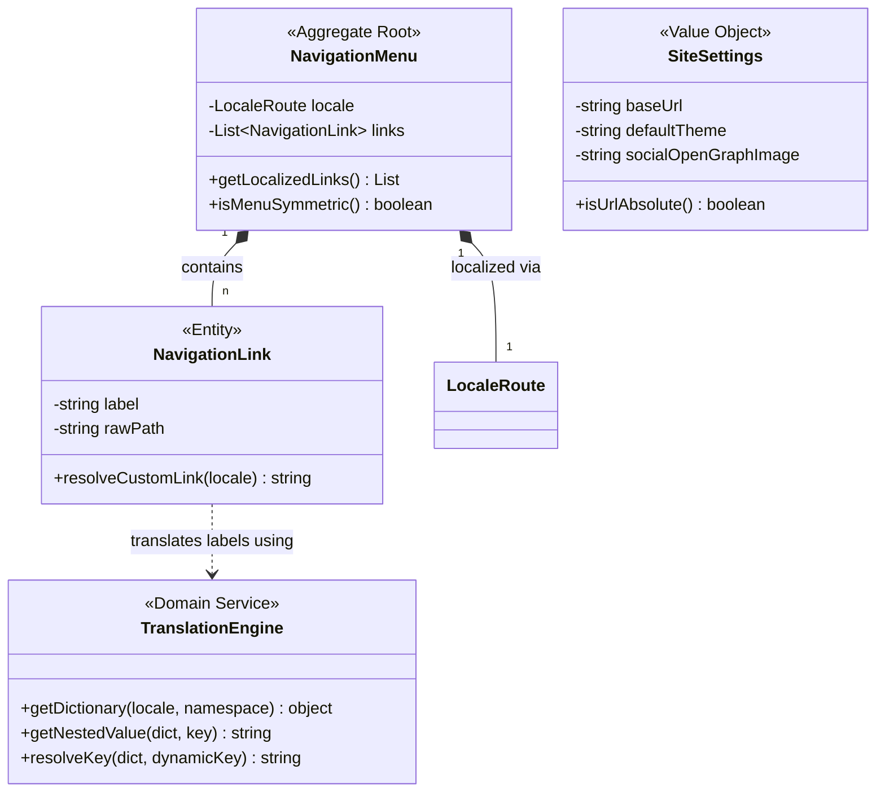

# Domain Model: Site Module

**Bounded Context:** site  
**Main Responsibility:** Navegación Global, Motor i18n y Configuración Común del Sitio.  
**Version:** 2.0.0

---

## Ubiquitous Language (Lenguaje Ubicuo)

| Term | Definition | Example |
|---|---|---|
| **NavigationMenu** | Estructura de navegación global con enlaces localizados bilingües. | `NavigationMenu(locale: "es")` |
| **TranslationEngine** | Motor dinámico y recursivo de traducción y fallbacks de namespaces. | `TranslationEngine.getNestedValue()` |
| **SiteSettings** | Ajustes de metadatos SEO basales e inyecciones lógicas de layout. | `{ baseUrl: "https://herman.dev", theme: "dark" }` |
| **LocaleRoute** | Segmento dinámico bilingüe utilizado por el enrutador de Next.js. | `LocaleRoute("es")` |

---

## Tactical Design (Diseño Táctico)

### 1. Aggregate Roots

- **`NavigationMenu`**: Encapsula el listado y jerarquía de enlaces del portafolio. Protege el invariante estricto de localización física de links, inyectando de forma forzada el locale activo para prevenir desvíos a rutas sin traducción.

### 2. Value Objects

- **`SiteSettings`**: Configuración inmutable de metatags SEO y faviconos.
- **`LocaleRoute`**: Validador rígido de idiomas. Garantiza que el locale inyectado corresponda a las constantes del sistema (`es` | `en`).

---

## Tactical Model (Class Diagram)

---

## Business Rules (Invariantes del Dominio)

1. **Localización de Navegación Forzada**: En el agregado `NavigationMenu`, ningún enlace interno (`NavigationLink`) puede carecer de prefijo localized. El interceptor `resolveCustomLink` valida e inyecta la ruta de idioma de forma imperativa.
2. **Invariante de Fallback de Traducciones**: El motor de traducciones `TranslationEngine` no puede retornar un valor nulo o indefinido bajo ninguna circunstancia. Si la resolución de 5 niveles en cascada falla, debe degradarse al literal plano de la clave (`key`), garantizando que Once UI renderice texto legible.
3. **Simetría del Menú**: Las opciones expuestas en el menú de navegación del Header y Footer deben ser simétricas entre Español e Inglés, previniendo visualizaciones inconsistentes o layouts rotos por falta de elementos.

---

[back](./readme.md)
