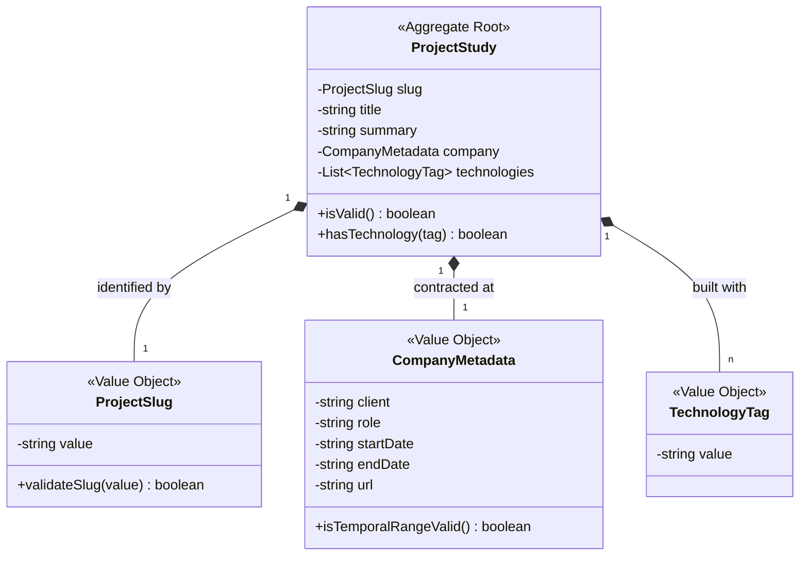

# Domain Model: Work Module

**Bounded Context:** work  
**Main Responsibility:** Gestión del Portafolio y Casos de Estudio de Proyectos Comerciales.  
**Version:** 2.0.0

---

## Ubiquitous Language (Lenguaje Ubicuo)

| Term | Definition | Example |
|---|---|---|
| **ProjectStudy** | Representación del caso de estudio de un proyecto comercial desarrollado por Herman. | `ProjectStudy(slug: "magic-portfolio")` |
| **CompanyMetadata** | Agrupación de datos del cliente o empresa contratante, incluyendo el rol que ejerció Herman y el periodo. | `{ client: "Magic Corp", role: "Frontend Lead" }` |
| **TechnologyTag** | Herramienta, framework o principio de arquitectura utilizado de forma principal en el proyecto. | `TechnologyTag("Once UI")` |
| **ProjectSlug** | Identificador único y URL-safe del proyecto, utilizado para enrutamientos localizados bilingües. | `ProjectSlug("personal-brand-port")` |

---

## Tactical Design (Diseño Táctico)

### 1. Aggregate Roots

- **`ProjectStudy`**: El caso de estudio de portafolio comercial. Protege los invariantes fundamentales de consistencia cronológica, integridad de metadatos de cliente y tipografía estricta de tags tecnológicos.

### 2. Value Objects

- **`CompanyMetadata`**: Encapsula la información comercial del cliente (ej: `client`, `role`, `period`, `url`). Es inmutable por definición.
- **`ProjectSlug`**: Representa el identificador único del proyecto. Valida en su constructor que el valor coincida con un patrón URL-safe rígido (`^[a-z0-9-]+$`), previniendo Directory Traversal (`../`).
- **`TechnologyTag`**: Representa una herramienta técnica del monorepo, obligatoriamente coincidente con el diccionario de tecnologías permitidas.

---

## Tactical Model (Class Diagram)

---

## Business Rules (Invariantes del Dominio)

1. **Rango Temporal Coherente**: En el objeto `CompanyMetadata`, la fecha de inicio del proyecto comercial debe ser cronológicamente anterior o igual a la fecha de finalización, a menos que el proyecto se declare explícitamente "en curso".
2. **Integridad Tecnológica**: Un `ProjectStudy` debe estar asociado obligatoriamente a al menos un `TechnologyTag` para permitir búsquedas interactivas en Once UI.
3. **Inmutabilidad de Slugs**: Una vez creado un caso de estudio, su `ProjectSlug` es inmutable. Cualquier alteración de URL requiere la declaración de un nuevo agregado o una política de redirección 301 explícita.

---

[back](./readme.md)
